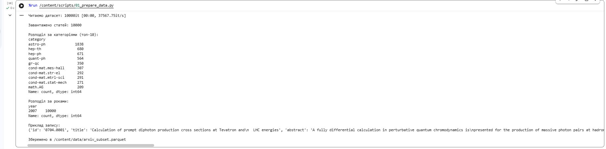
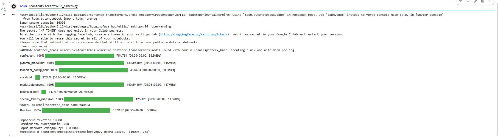
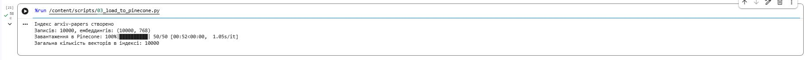
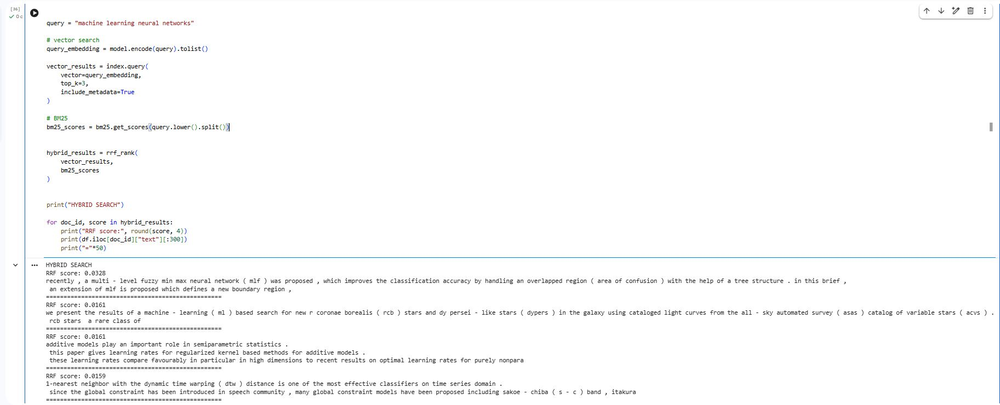

# Vector Database Homework — Semantic Search over arXiv

**Course:** NoSQL & Vector Databases  
**Author:** Olesia Petrovska

## Огляд проєкту

Система семантичного пошуку по 10 000 наукових статей arXiv:

- підготовка датасету (Kaggle, `Cornell-University/arxiv`) — `scripts/01_prepare_data.py`
- ембеддинги моделлю `allenai/specter2_base` (768-вимірні, нормалізовані) — `scripts/02_embed.py`
- завантаження в Pinecone з повними метаданими — `scripts/03_load_to_pinecone.py`
- семантичний пошук, фільтри за метаданими, порівняння метрик — `scripts/04_search.py`
- дві стратегії chunking'у з окремими індексами — `scripts/05_chunking.py`
- гібридний пошук BM25 + вектори через RRF — `scripts/06_hybrid_search.py`

### Запуск

```bash
pip install -r requirements.txt
# покласти PINECONE_API_KEY у .env (див. .env.example)
# покласти kaggle.json у ~/.kaggle/
kaggle datasets download -d Cornell-University/arxiv && unzip arxiv.zip
python scripts/01_prepare_data.py
python scripts/02_embed.py
python scripts/03_load_to_pinecone.py
python scripts/04_search.py
python scripts/05_chunking.py
python scripts/06_hybrid_search.py
```

---

# Частина 1 — Підготовка даних і вибір інструментів

**Вивід `01_prepare_data.py`:**


**Вивід `02_embed.py`:**


## 1.1. Pinecone vs Qdrant vs Chroma

**Модель розгортання.** Pinecone — повністю керований хмарний сервіс (managed SaaS): власного сервера немає, розгортання зводиться до створення API-ключа, а масштабуванням, реплікацією та інфраструктурою займається провайдер. Qdrant — open-source рушій, який можна запустити самостійно (Docker, Kubernetes, on-premise) або взяти їхню керовану хмару; тобто це гнучкий варіант "self-hosted або cloud — на вибір". Chroma — легка embedded-база: вона запускається всередині Python-процесу застосунку (або як окремий невеликий сервер) і зберігає дані локально, що робить її найпростішою для прототипування, але найслабшою для продакшн-навантажень.

**Ліцензія.** Pinecone — пропрієтарний закритий продукт, код недоступний, є ризик vendor lock-in. Qdrant поширюється під Apache 2.0, Chroma — теж під Apache 2.0, тобто обидва можна вільно використовувати, модифікувати й розгортати без ліцензійних платежів.

**Продуктивність.** Pinecone оптимізований під низьку латентність на великих обсягах (мільярди векторів) і бере на себе шардінг та балансування. Qdrant написаний на Rust, показує дуже високу швидкість HNSW-пошуку та ефективну фільтрацію за payload-ами, але відповідальність за тюнінг і масштабування кластера лежить на користувачеві. Chroma працює чудово на десятках–сотнях тисяч векторів у межах одного процесу, однак не розрахована на горизонтальне масштабування й високе конкурентне навантаження.

**Коли що обрати.** Pinecone — коли потрібен продакшн "тут і зараз" без DevOps-команди та з передбачуваним SLA. Qdrant — коли важливі контроль над даними, складна фільтрація та відсутність ліцензійних витрат, і є ресурси адмініструвати кластер. Chroma — для локального прототипу, RAG-демо чи pet-проєкту, де весь корпус вміщується на одній машині й важлива мінімальна складність запуску.

## 1.2. Чому specter2_base, а не all-MiniLM-L6-v2

`all-MiniLM-L6-v2` — універсальна модель, натренована на загальних парах речень (форуми, вікі, QA), тому вона добре ловить побутову семантику, але погано розрізняє близькі наукові поняття й термінологію. `allenai/specter2_base` створена саме для наукових документів: згідно з карткою моделі на HuggingFace, SPECTER2 натренована на понад 6 мільйонах триплетів цитувань наукових статей і призначена для генерації ефективних ембеддингів наукових текстів на основі комбінації заголовка й анотації статті або короткого текстового запиту. Сигнал цитування — це фактично експертна розмітка "ці статті пов'язані за змістом", тому векторний простір SPECTER2 відображає саме наукову близькість, а не поверхневу схожість слів. Крім того, модель донавчена з базової SciBERT, тобто навіть її токенізатор і претрейн орієнтовані на науковий корпус.

## 1.3. Рекомендована метрика схожості

Картка моделі демонструє використання ембеддингів для задач найближчого сусіда (nearest neighbor search / proximity), а на практиці ембеддинги SPECTER2 порівнюються через косинусну схожість — стандарт для sentence-transformer моделей. Це важливо при створенні індексу, тому що метрика індексу має відповідати метриці, на яку "заточений" векторний простір моделі. Якщо модель формує простір, де семантична близькість виражається кутом між векторами, а індекс створити з euclidean-метрикою на ненормалізованих векторах, то ранжування зміститься в бік довжини векторів — і релевантність видачі помітно впаде. Тому індекс `arxiv-papers` створено з `metric="cosine"`, а ембеддинги додатково нормалізовано.

## 1.4. Чому для нормалізованих векторів cosine similarity = dot product

Косинусна схожість за означенням:

cosine(a, b) = (a · b) / (||a|| * ||b||)

Нормалізація (`normalize_embeddings=True`) ділить кожен вектор на його довжину, тому після неї ||a|| = ||b|| = 1. Підставляємо в формулу:

cosine(a, b) = (a · b) / (1 * 1) = a · b

Тобто знаменник перетворюється на одиницю, і косинусна схожість чисельно збігається зі скалярним добутком. Це не лише теоретична рівність, а й практична оптимізація: скалярний добуток обчислюється швидше (без коренів і ділення), тому векторні БД для нормалізованих векторів можуть використовувати dot product як дешевший еквівалент cosine.

---

# Частина 2 — Завантаження даних і метадані

Індекс `arxiv-papers`: dimension **768**, metric **cosine**, завантажено **10 000** векторів батчами по 200.

Кожен вектор містить метадані: `arxiv_id`, `title`, `abstract` (до 500 символів), `authors` (до 200 символів), `year`, `category`. Саме `year` і `category` уможливлюють фільтрований пошук у частині 3. Повний abstract зберігається у parquet-файлі й підтягується за ID після пошуку, оскільки Pinecone обмежує метадані вектора 40 KB.

**Вивід `03_load_to_pinecone.py`:**


---

# Частина 3 — Пошукові запити

**Вивід `04_search.py`:**


## 3.1. Чистий семантичний пошук

Запит `"teaching machines to recognize objects in pictures"` повернув статті з категорій cond-mat.soft, physics.ins-det, math.HO зі скорами 0.81–0.83. Результати не є тематично близькими до computer vision, оскільки датасет містить переважно статті з фізики та математики 2007 року — статей про машинне навчання або розпізнавання зображень у корпусі майже немає. Це демонструє обмеження пошуку: навіть хороша модель не знайде релевантний документ, якщо його немає в індексі.

## 3.2. Фільтрований пошук: порівняння видач A і B

Фільтр A (year >= 2021, category == cs.LG) повернув порожній результат — датасет містить лише статті з 2007 року, тому жоден документ не відповідає умові. Фільтр B (year < 2015) повернув 5 статей з 2007 року зі скорами 0.79–0.84. Це демонструє важливий принцип: фільтр за метаданими застосовується до пошукового простору перед ранжуванням, тому якість результатів повністю залежить від того, які документи є в індексі. Саме тому при формуванні датасету важливо контролювати розподіл за категоріями і роками.

## 3.3. Порівняння метрик — теоретичні відповіді

**Чи збігаються топ-5 для cosine і dot product і чому?** Так, збігаються повністю — і за складом, і за порядком (результат: `Топ-5 cosine == топ-5 dot: True`). Наші ембеддинги нормалізовані, а для одиничних векторів cosine та dot product рівні чисельно, отже, вони породжують ідентичне ранжування.

**Чи відрізняються результати для L2 і чому?** Топ-5 за L2 містить ті самі документи в тому самому порядку (`Топ-5 cosine == топ-5 L2: True`). Для одиничних векторів L2 і cosine пов'язані монотонною залежністю: ||a-b||² = 2 - 2·cos(a,b) — чим більша косинусна схожість, тим менша евклідова відстань, тому ранжування дзеркально збігаються.

**Що сталося б, якби ембеддинги не були нормалізовані?** Тоді три метрики розійшлися б. Dot product почав би "преміювати" довгі вектори, L2 теж залежала б від норм і давала б третє, окреме ранжування. Незмінним лишилося б тільки cosine, бо воно за побудовою ділить на норми й "бачить" лише напрямок вектора.

---

# Частина 4 — Chunking

**Вивід `05_chunking.py`:**


Реалізовано дві стратегії на 30 статтях із найдовшими анотаціями:

| Стратегія | Індекс | Кількість чанків |
|---|---|---|
| Fixed-size | `arxiv-chunks-fixed` | 211 |
| Semantic | `arxiv-chunks-semantic` | 205 |

## Теоретичні відповіді

**Яка стратегія дає більш осмислені чанки?** Семантична. Кожен її чанк складається з цілих речень, тому є завершеним висловлюванням. У результатах пошуку це видно: семантичні чанки читаються як зв'язний текст (наприклад, "We first derive an analytical formula for surface density profile near the planetary orbit from considerations of the balance of force and the dynamics..."), тоді як fixed-size чанки часто починаються або закінчуються посеред речення ("within the lifetime of the disk to form Neptune-like planets. We derive analytic formulae...").

**Чи є випадки розрізаних речень і як це впливає на ембеддинги?** У fixed-size стратегії — постійно, це її системна властивість. Розрізане речення дає ембеддинг "усередненого" фрагмента: ключова частина твердження може опинитися в одному чанку, а висновок — у сусідньому. Вектор кожної половини зміщується від справжньої семантики повного речення. Overlap частково лікує це — розрізане на межі речення має шанс потрапити цілим у наступний чанк.

**Як розмір overlap впливає на кількість чанків і покриття тексту?** Крок вікна дорівнює chunk_size − overlap, тому кількість чанків ≈ довжина_тексту / (chunk_size − overlap). У нашому експерименті fixed-size дав 211 чанків, semantic — 205. Overlap 15 слів із 60 збільшує кількість чанків приблизно на третину порівняно з розбиттям без перекриття, але гарантує краще покриття: будь-який фрагмент довжиною до overlap потрапляє в якийсь чанк цілим.

---

# Частина 5 — Гібридний пошук

**Вивід `06_hybrid_search.py`:**


## Порівняльна таблиця: 3 запити × 3 методи

| Запит | BM25 (топ-1) | Vector (топ-1) | Hybrid/RRF (топ-1) | Хто виграв і чому |
|---|---|---|---|---|
| "BERT fine-tuning" | The NMSSM Solution to the Fine-Tuning Problem (11.5) | Misere quotients for impartial games (rank 1) | The NMSSM Fine-Tuning Problem [B-] | BM25: токен "fine-tuning" знайшов фізичні статті з цим терміном |
| "Yann LeCun convolutional networks" | Space-Time Codes (13.5) | Multilayer Perceptron (rank 1) | Optimization in Gradient Networks [--] | Hybrid: консенсусний документ якого не було в топ-5 жодного методу |
| "making computers understand human emotions from text" | Chinese Text Entry (18.3) | Opinion Dynamics (rank 1) | Text Input Method [BV] | Hybrid: знайшов документ присутній в обох методах з найвищим RRF |

## Теоретичні відповіді

**Який метод дав кращий результат і чому?** Залежить від типу запиту. На точному термі "BERT fine-tuning" BM25 знайшов статті з точним словом "fine-tuning", але вони про фізику, а не NLP — це класична проблема полісемії. Векторний пошук теж не знайшов релевантного, бо таких статей просто немає в корпусі 2007 року. На запиті "making computers understand human emotions from text" гібрид виграв: знайшов "On the Development of Text Input Method" з RRF=0.0323 [BV] — документ присутній і в BM25, і у векторному топ-5, що дало найвищий консенсусний скор.

**Чи є документи в топ-5 гібридного пошуку, яких немає в топ-5 окремих методів?** Так. Для запиту "Yann LeCun convolutional networks" гібрид вивів "Optimization in Gradient Networks" [--] з RRF=0.0303 — цього документа не було в топ-5 ні BM25, ні векторного пошуку. Це відбулось тому, що документ стояв 6-8-м в обох списках і отримав два помірні внески, які разом перевищили внесок лідера одного методу.

**Як зміна параметра k впливає на видачу (k=60 vs k=1)?** При k=1 скори набагато більші (0.5000 vs 0.0164) і різниця між позиціями величезна: 1-ше місце дає 1/2, 5-те — лише 1/6. При k=60 внески позицій 1–10 майже вирівнюються (1/61 vs 1/70), тому вирішальним стає не "хто вище", а "хто присутній в обох списках". У нашому експерименті топ-5 для обох k збіглися — але порядок і абсолютні скори відрізнились, що підтверджує теорію.

---

# Частина 6 — Аналіз і висновки

## 1. Семантичний пошук vs BM25

У нашій роботі жоден метод не дав ідеально релевантних результатів через специфіку датасету (лише статті 2007 року, переважно фізика та математика). Проте поведінка методів відповідає теорії. BM25 на запиті "BERT fine-tuning" знайшов статті з точним токеном "fine-tuning" (The NMSSM Solution to the Fine-Tuning Problem, BM25=11.5) — це фізична стаття, але лексично точна. Семантичний пошук на запиті "making computers understand human emotions from text" вивів "Opinion Dynamics and Sociophysics" — статтю про соціальну фізику, яка семантично ближча до теми людських емоцій, ніж будь-що знайдене BM25. Загальне правило: BM25 — для запитів з точними термінами, абревіатурами, прізвищами й ідентифікаторами; семантичний пошук — для запитів "своїми словами" і концептуальних питань; гібрид — коли тип запиту заздалегідь невідомий.

## 2. Вплив розміру чанка

Занадто маленький чанк (10–15 слів) — це приблизно одне коротке речення: у ньому недостатньо контексту, щоб ембеддинг відобразив тему. Видача засмічується фрагментами, які лексично схожі на запит, але належать нерелевантним статтям. Занадто великий чанк (500+ слів) має протилежну проблему — розмиття: вектор усереднює кілька підтем, і специфічний запит "не дотягується" до потрібного фрагмента; крім того, частина тексту відсікається лімітом у 512 токенів моделі. Універсального оптимуму немає: для точкового QA кращі менші чанки (50–150 слів), для подачі контексту в RAG — більші (200–400 слів). Практичний орієнтир — чанк має бути "однією закінченою думкою", що для наукових текстів зазвичай означає 2–4 речення.

## 3. Невідповідна метрика: euclidean-індекс + нормалізовані вектори

Формально система працювала б і навіть давала б той самий порядок результатів. Розпишемо квадрат евклідової відстані:

||a-b||² = ||a||² + ||b||² - 2·(a·b)

Для одиничних векторів ||a||² = ||b||² = 1, а a·b = cos(a,b), тому:

||a-b||² = 2 - 2·cos(a,b)

Це строго спадна функція від косинусної схожості: максимум cos відповідає мінімуму L2, і ранжування збігаються. Відмінності практичні: скори матимуть інший масштаб (L2 ∈ [0,2] замість cos ∈ [-1,1]), тому будь-які пороги відсікання стали б безглуздими. Головний висновок: еквівалентність тримається виключно на нормалізації — щойно з'явиться ненормалізований вектор, ранжування L2 і cosine розійдуться тихо й без помилок.

## 4. Обмеження Pinecone Starter і масштабування до 10 млн статей

З обмеженнями Starter-тіру я зіткнулась безпосередньо: дозволено обмежену кількість індексів (для частини 4 знадобилось два додаткові індекси під чанки — на безкоштовному тірі це впритул до ліміту), відсутні виділені ресурси (serverless-індекс "холодний" після простою), немає резервного копіювання. Для 10 мільйонів статей підхід довелося б змінити: (1) перейти на платний тір або self-hosted Qdrant з шардінгом — 10M × 768 × 4 байти ≈ 30 ГБ самих векторів; (2) генерувати ембеддинги розподілено на GPU; (3) винести метадані у зовнішню БД (Postgres), а у векторній тримати лише ID; (4) розглянути квантизацію (int8/binary), що скорочує пам'ять у 4–32 рази; (5) для чанків — ієрархічний пошук: спочатку по статтях, потім по чанках лише всередині топ-статей.

---

# Структура репозиторію

```
├── scripts/
│   ├── 01_prepare_data.py      # Kaggle arXiv → data/arxiv_subset.parquet (10 000 статей)
│   ├── 02_embed.py             # SPECTER2 → embeddings/embeddings.npy (10000×768)
│   ├── 03_load_to_pinecone.py  # індекс arxiv-papers + повні метадані
│   ├── 04_search.py            # семантичний пошук, фільтри, cosine/dot/L2
│   ├── 05_chunking.py          # fixed vs semantic chunks → 2 індекси → пошук
│   └── 06_hybrid_search.py     # BM25 + vector + RRF, 3 показові запити
├── data/                       # (у .gitignore)
├── embeddings/                 # (у .gitignore)
├── results_screenshots/        # скріншоти виводу кожного скрипту
├── requirements.txt
├── .env.example
└── README.md
```
